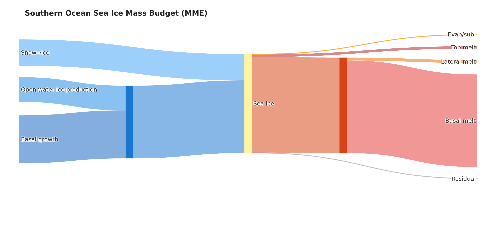
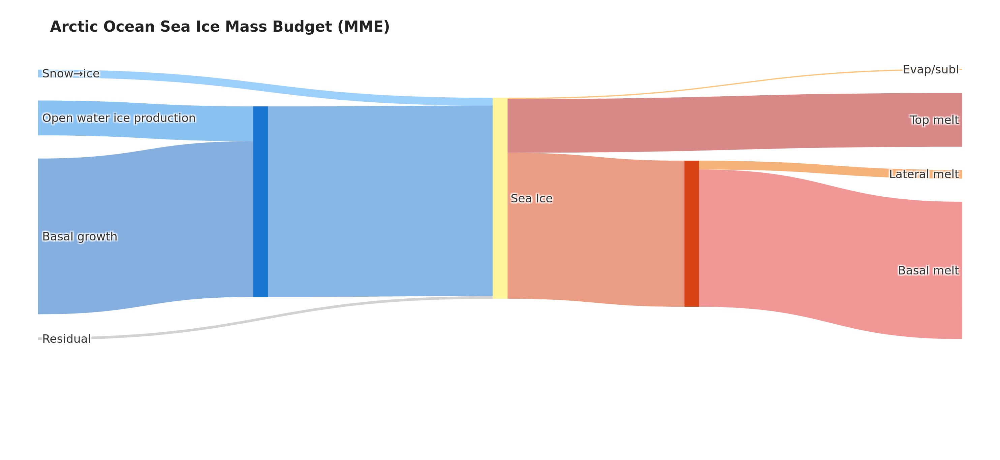
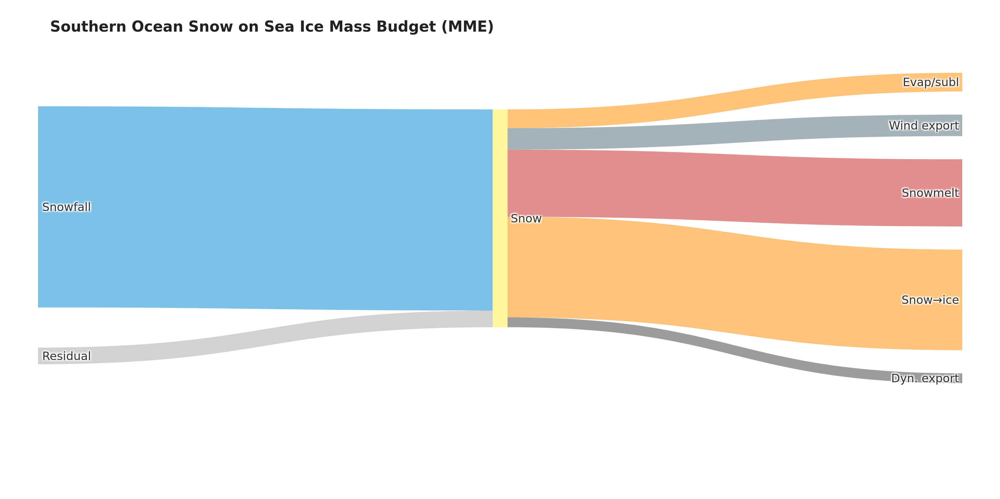
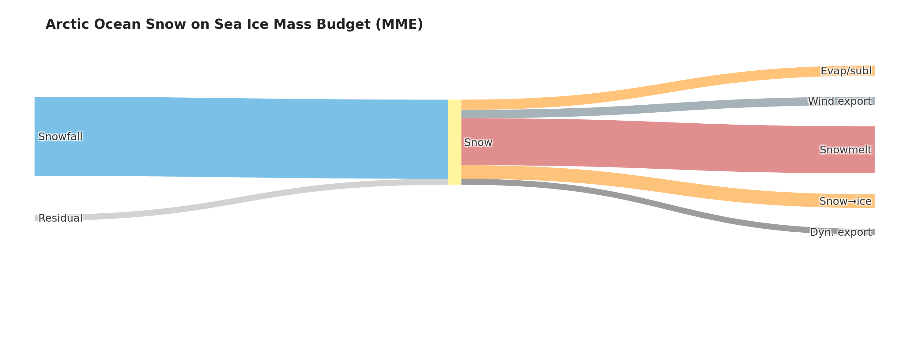

# Sea Ice Mass Balance Sankey Diagrams

**Lead:** Alek Petty | **Data visuals:** Chris Cardinale | **Co-I:** Maddie Smith

With thanks to the SIMIP community for helpful discussion.

## Environment Setup

### JupyterHub / existing conda environment

If you are working in a shared JupyterHub where the base environment already has most scientific packages (numpy, xarray, dask, geopandas, etc.), install the missing packages with pip:

```bash
pip install cf-xarray xesmf esgf-pyclient intake-esgf globus-sdk cmocean kaleido
```

### Fresh install: conda/mamba (recommended)

`xesmf` and `cartopy` have binary dependencies that conda resolves more reliably than pip. [Mamba](https://mamba.readthedocs.io) is a faster drop-in replacement for conda.

```bash
mamba env create -f environment.yml   # or: conda env create -f environment.yml
conda activate sea-ice-mass-balance
python -m ipykernel install --user --name sea-ice-mass-balance --display-name "sea-ice-mass-balance"
```

Then restart JupyterHub/JupyterLab and select the `sea-ice-mass-balance` kernel.

### Fresh install: pip/uv

```bash
curl -LsSf https://astral.sh/uv/install.sh | sh
uv venv --python 3.12
source .venv/bin/activate
uv pip install -r requirements.txt
python -m ipykernel install --user --name sea-ice-mass-balance --display-name "sea-ice-mass-balance"
```

## Overview

Sankey diagrams of sea ice and snow-on-ice mass budgets derived from CMIP6 models and the CESM2 Large Ensemble (CESM2-LE). Budget terms are area-integrated over the Southern Ocean and Arctic Ocean for a 2015–2034 climatological period, then displayed as flow diagrams where ribbon width is proportional to annual mass flux. Flux widths are normalized across both hemispheres so Arctic and Southern Ocean figures can be compared directly.

The diagrams show the primary sources (basal growth, frazil ice, snowfall, snow→ice conversion) and sinks (top melt, basal melt, lateral melt, evaporation/sublimation) of each reservoir, with thermodynamic growth terms grouped into an intermediate **Ocean Growth** node and thermodynamic melt terms into an **Ocean Melt** node.

### Ice Mass Budget
**Southern Ocean**


**Arctic Ocean**


### Snow Mass Budget
**Southern Ocean**


**Arctic Ocean**


## Models and Period

| Model | Institution | Notes |
|---|---|---|
| ACCESS-CM2 | CSIRO/ARCCSS | Ice budget requires area-basis and sign corrections; excluded from snow budget due to unreliable snowmelt output |
| HadGEM3-GC31-LL | Met Office | Snow dynamics available; no snow wind drift or snow sublimation output |
| UKESM1-0-LL | Met Office / MOHC | Snow dynamics available; no snow wind drift or snow sublimation output |
| NorESM2-LM | NCC | Snow wind drift available; no snow dynamics or snow sublimation; snowfall and snowmelt require sign/unit corrections |
| NorESM2-MM | NCC | Snow wind drift available; no snow dynamics or snow sublimation; snowfall and snowmelt require sign/unit corrections |
| CESM2-LE | NCAR | Large ensemble (100 members); only model with snow evaporation/sublimation output |

**Period:** 2015–2034 (20-year climatological mean across all available ensemble members)

## Workflow

Two notebooks run in sequence:

1. **`model_load.ipynb`** — Loads gridded CMIP6 budget variables from ESGF/Pangeo and CESM2-LE from local storage or THREDDS OPeNDAP. Applies all model-specific corrections (see below). Area-integrates fluxes over the Southern Ocean, Weddell Sea, and Arctic Ocean. Saves one `.nc` file per variable per model to `save_path`. Process one CMIP6 model at a time by setting `models`.

2. **`sankey_figures.ipynb`** — Reads the `.nc` files from `melt_path` (must match `save_path`), merges CMIP6 and CESM2-LE data, and generates Sankey diagrams for each model and the multi-model ensemble mean. Figures are written to `figures/` as both `.png` and `.pdf` and optionally `.svg`.

## Model-Specific Corrections

Several models required corrections to standardize outputs to a common sign convention (losses negative, gains positive) and a common area basis (per grid-cell area) before area-integration. These are applied in `model_load.ipynb`.

### Ice Mass Budget

| Model | Correction |
|---|---|
| **ACCESS-CM2** | `sidmassth` and `sidmassdyn` are per grid-cell area (no scaling needed). All other ice flux variables are incorrectly reported per sea-ice area — multiplied by `siconc/100` to convert to per grid-cell area before integration. `sidmassevapsubl` is reported positive (mass loss) — multiplied by −1 to enforce the loss-negative sign convention. |
| **HadGEM3-GC31-LL, UKESM1-0-LL** | `sidmassevapsubl` is reported positive (mass loss) — multiplied by −1 to enforce the loss-negative sign convention. |
| **NorESM2-LM, NorESM2-MM** | `sidmassmelttop`, `sidmassmeltbot`, and `sidmasslat` are reported positive (mass loss) — multiplied by −1 to enforce the loss-negative sign convention. |
| **CESM2-LE** | `sidmassmelttop`, `sidmassmeltbot`, and `sidmasslat` are reported positive (mass loss) — multiplied by −1 to enforce the loss-negative sign convention. |

### Snow Mass Budget

| Model | Correction |
|---|---|
| **ACCESS-CM2** | All snow variables reported per sea-ice area — multiplied by `siconc/100`. Snowmelt (`sndmassmelt`) is anomalously large; divided by 3.3 (snow density / 100) as a correction. `sndmasswindrif` and `sndmasssubl` are unavailable. |
| **HadGEM3-GC31-LL, UKESM1-0-LL** | `sndmasswindrif` and `sndmasssubl` are unavailable. |
| **NorESM2-LM, NorESM2-MM** | `sndmassmelt` is reported positive (mass loss) — multiplied by −1 to enforce the loss-negative sign convention. `sndmasssnf` values are 330× too large due to a unit conversion error in the published CMIP6 output — divided by snow density (330 kg m⁻³) to correct ([NorESMhub/noresm2cmor #282](https://github.com/NorESMhub/noresm2cmor/issues/282)). `sndmasssubl` and `sndmassdyn` are unavailable. |
| **CESM2-LE** | `sndmassmelt` is reported positive (mass loss) — multiplied by −1 to enforce the loss-negative sign convention. Snow→ice transfer (`sidmasssi`) is on the ice-budget side — converted to snow-budget units by multiplying by `-(330/917)` (snow/ice density ratio). |

### Variable Availability by Model

Availability across the full CMIP6 archive (native grid, `SImon`, `ssp245`) as surfaced by the catalog search in `model_load.ipynb` (`availability_df`), plus CESM2-LE (loaded separately from NCAR storage, not through the ESGF/cloud catalog). ⭐ marks the models currently used in the Sankey figures (alphabetical order).

**Ice Mass Budget**

| Model | Top Melt | Basal Melt | Lateral Melt | Basal Growth | Frazil | Snow→Ice | Evap/Subl | Dynamics |
|---|---|---|---|---|---|---|---|---|
| ⭐ ACCESS-CM2 | ✓ | ✓ | ✓ | ✓ | ✓ | ✓ | ✓ | ✓ |
| ACCESS-ESM1-5 | — | — | — | — | — | — | ✓ | — |
| AWI-CM-1-1-MR | — | — | — | — | — | ✓ | ✓ | — |
| BCC-CSM2-MR | ✓ | ✓ | — | — | ✓ | ✓ | ✓ | — |
| CAMS-CSM1-0 | ✓ | ✓ | — | — | — | ✓ | ✓ | — |
| CAS-ESM2-0 | ✓ | ✓ | ✓ | ✓ | ✓ | ✓ | — | ✓ |
| CESM2 | ✓ | ✓ | ✓ | ✓ | ✓ | ✓ | ✓ | ✓ |
| ⭐ CESM2-LE | ✓ | ✓ | ✓ | ✓ | ✓ | ✓ | ✓ | ✓ |
| CESM2-WACCM | ✓ | ✓ | ✓ | ✓ | ✓ | ✓ | ✓ | ✓ |
| CIESM | ✓ | ✓ | ✓ | ✓ | ✓ | ✓ | ✓ | ✓ |
| CMCC-CM2-SR5 | ✓ | ✓ | ✓ | ✓ | ✓ | ✓ | ✓ | ✓ |
| CMCC-ESM2 | ✓ | ✓ | ✓ | ✓ | ✓ | ✓ | ✓ | ✓ |
| CNRM-CM6-1 | ✓ | ✓ | ✓ | ✓ | ✓ | ✓ | ✓ | ✓ |
| CNRM-CM6-1-HR | ✓ | ✓ | ✓ | ✓ | ✓ | ✓ | ✓ | ✓ |
| CNRM-ESM2-1 | ✓ | ✓ | ✓ | ✓ | ✓ | ✓ | ✓ | ✓ |
| EC-Earth3 | ✓ | ✓ | — | ✓ | ✓ | ✓ | ✓ | ✓ |
| EC-Earth3-CC | ✓ | ✓ | — | ✓ | ✓ | ✓ | ✓ | — |
| EC-Earth3-Veg | ✓ | ✓ | — | ✓ | ✓ | ✓ | ✓ | — |
| EC-Earth3-Veg-LR | ✓ | ✓ | — | ✓ | ✓ | ✓ | ✓ | — |
| FGOALS-f3-L | ✓ | ✓ | ✓ | ✓ | ✓ | ✓ | — | ✓ |
| FGOALS-g3 | ✓ | ✓ | ✓ | ✓ | ✓ | ✓ | — | ✓ |
| FIO-ESM-2-0 | — | — | — | — | — | — | — | — |
| GISS-E2-1-G | ✓ | ✓ | ✓ | ✓ | ✓ | ✓ | ✓ | — |
| GISS-E2-1-G-CC | ✓ | ✓ | ✓ | ✓ | ✓ | ✓ | ✓ | — |
| GISS-E2-1-H | ✓ | ✓ | ✓ | ✓ | ✓ | ✓ | ✓ | — |
| GISS-E2-2-G | ✓ | ✓ | ✓ | ✓ | ✓ | ✓ | ✓ | — |
| ⭐ HadGEM3-GC31-LL | ✓ | ✓ | ✓ | ✓ | ✓ | ✓ | ✓ | ✓ |
| IPSL-CM6A-LR | ✓ | ✓ | — | ✓ | ✓ | ✓ | ✓ | ✓ |
| MPI-ESM1-2-HR | — | — | — | — | — | — | — | ✓ |
| MPI-ESM1-2-LR | — | — | — | — | — | — | — | ✓ |
| MRI-ESM2-0 | ✓ | ✓ | ✓ | ✓ | ✓ | ✓ | ✓ | ✓ |
| NESM3 | — | — | — | — | — | — | — | — |
| ⭐ NorESM2-LM | ✓ | ✓ | ✓ | ✓ | ✓ | ✓ | ✓ | ✓ |
| ⭐ NorESM2-MM | ✓ | ✓ | ✓ | ✓ | ✓ | ✓ | ✓ | ✓ |
| TaiESM1 | ✓ | ✓ | — | ✓ | ✓ | — | — | — |
| ⭐ UKESM1-0-LL | ✓ | ✓ | ✓ | ✓ | ✓ | ✓ | ✓ | ✓ |

**Snow Mass Budget**

| Model | Melt | Snowfall | Snow→Ice | Evap/Subl | Wind Drift | Dynamics |
|---|---|---|---|---|---|---|
| ⭐ ACCESS-CM2 | ✓ | ✓ | ✓ | — | — | ✓ |
| ACCESS-ESM1-5 | — | ✓ | — | — | — | — |
| AWI-CM-1-1-MR | — | — | — | — | — | — |
| BCC-CSM2-MR | ✓ | ✓ | — | — | — | — |
| CAMS-CSM1-0 | — | ✓ | — | — | — | — |
| CAS-ESM2-0 | ✓ | ✓ | — | — | — | — |
| CESM2 | ✓ | ✓ | — | — | — | — |
| ⭐ CESM2-LE | ✓ | ✓ | ✓ | ✓ | — | — |
| CESM2-WACCM | ✓ | ✓ | — | ✓ | — | — |
| CIESM | ✓ | ✓ | — | — | — | — |
| CMCC-CM2-SR5 | ✓ | ✓ | — | ✓ | — | — |
| CMCC-ESM2 | ✓ | ✓ | — | ✓ | — | — |
| CNRM-CM6-1 | ✓ | ✓ | ✓ | ✓ | — | ✓ |
| CNRM-CM6-1-HR | ✓ | ✓ | ✓ | ✓ | — | ✓ |
| CNRM-ESM2-1 | ✓ | ✓ | ✓ | ✓ | — | ✓ |
| EC-Earth3 | ✓ | ✓ | ✓ | ✓ | — | ✓ |
| EC-Earth3-CC | ✓ | ✓ | — | — | — | — |
| EC-Earth3-Veg | ✓ | ✓ | — | — | — | — |
| EC-Earth3-Veg-LR | ✓ | ✓ | — | — | — | — |
| FGOALS-f3-L | ✓ | ✓ | ✓ | — | — | — |
| FGOALS-g3 | ✓ | ✓ | ✓ | — | — | — |
| FIO-ESM-2-0 | — | ✓ | — | — | — | — |
| GISS-E2-1-G | — | ✓ | — | — | — | — |
| GISS-E2-1-G-CC | — | ✓ | — | — | — | — |
| GISS-E2-1-H | — | ✓ | — | — | — | — |
| GISS-E2-2-G | — | ✓ | — | — | — | — |
| ⭐ HadGEM3-GC31-LL | ✓ | ✓ | ✓ | — | — | ✓ |
| IPSL-CM6A-LR | ✓ | ✓ | ✓ | ✓ | — | ✓ |
| MPI-ESM1-2-HR | — | ✓ | — | — | — | ✓ |
| MPI-ESM1-2-LR | — | ✓ | — | — | — | ✓ |
| MRI-ESM2-0 | ✓ | ✓ | ✓ | ✓ | — | ✓ |
| NESM3 | — | — | ✓ | — | — | — |
| ⭐ NorESM2-LM | ✓ | ✓ | ✓ | — | ✓ | — |
| ⭐ NorESM2-MM | ✓ | ✓ | ✓ | — | ✓ | — |
| TaiESM1 | ✓ | — | — | — | — | — |
| ⭐ UKESM1-0-LL | ✓ | ✓ | ✓ | — | — | ✓ |

**Note:** Snow-side snow→ice conversion (`sndmasssi`) is missing for many models, but can be derived from the ice-side snow-to-ice tendency (`sidmasssi`) via the snow/ice density ratio when the ice-side variable is available. This is how CESM2-LE's `sndmasssi` is computed (see [Model-Specific Corrections](#snow-mass-budget)).

## Known Issues and Caveats

- **Model results only.** These are not observationally constrained budgets.
- **Low model diversity.** Only six models are currently included; expansion is planned.
- **Snow budgets are uncertain.** Inconsistent and incomplete snow flux outputs across models make the snow Sankeys less reliable than the ice Sankeys.
- **ACCESS-CM2 excluded from snow budget** due to extreme snowmelt values far outside the range of budget closure. It is retained in the ice budget.
- **Non-zero wind drift and dynamics at hemispheric scale.** Summing over a full hemisphere should produce near-zero dynamics and wind drift, but small non-zero values remain. This may reflect physical processes (e.g., snow lost to the ocean via wind or ice deformation at the ice edge) or model artifacts.
- **Evaporation/sublimation** is only available from CESM2-LE on the snow side. Other models could not provide the same output split.
- **Wind drift** is only available from NorESM2 models.
- **Ice dynamics** on the snow side is only available from HadGEM3-GC31-LL and UKESM1-0-LL.
- **Frazil ice** calculations are inconsistent across models and require further investigation.

## Updates

**June 12, 2026**
- Flux bar widths normalized across hemispheres to enable direct Arctic/Southern Ocean comparisons.
- Added intermediate **Ocean Growth** and **Ocean Melt** grouping nodes to connect thermodynamically related terms and reflect differing model definitions in the literature.

## Extra plot ideas

- Follow the Keen et al. (2021) sea ice mass budget analysis and include an Inner Arctic Ocean domain approach that would allow for a dynamics/ice export contribution.
