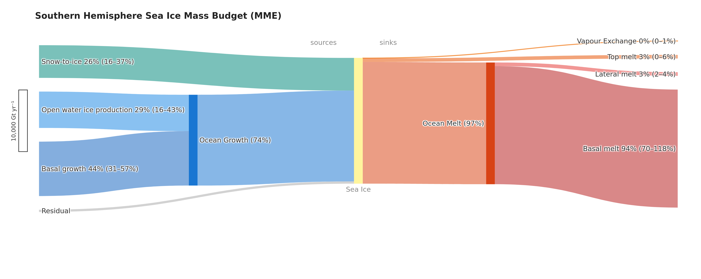
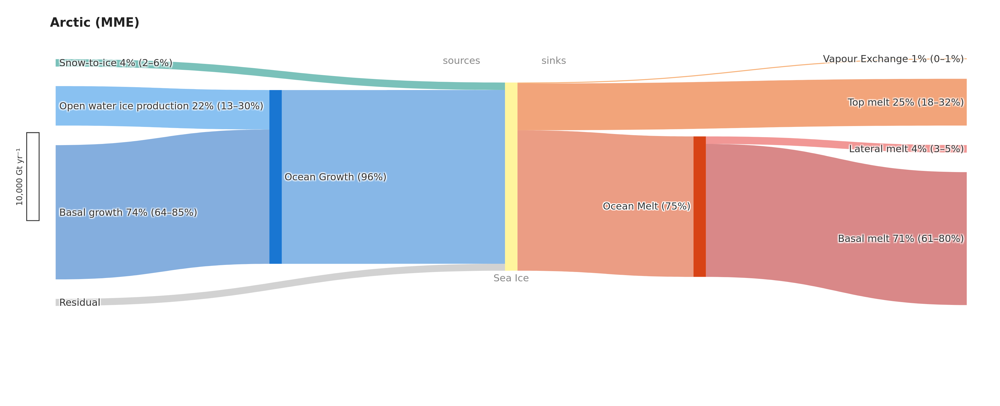
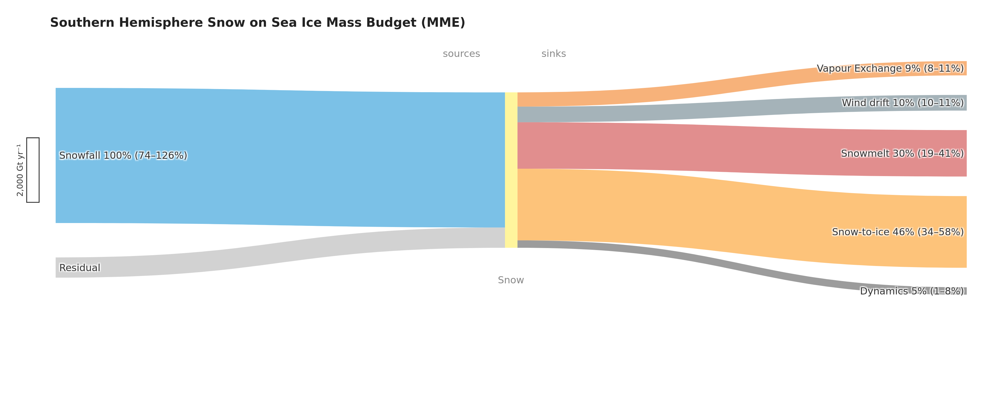
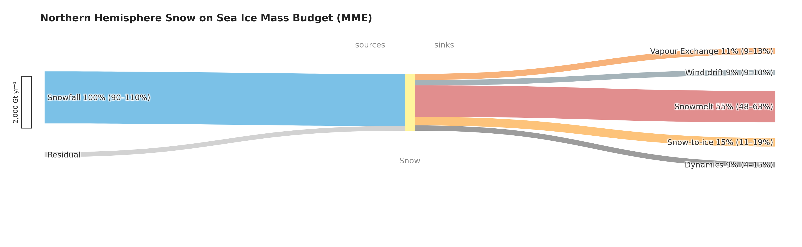

# Sea Ice Mass Balance Sankey Diagrams

**Lead:** Alek Petty | **Data visuals:** Chris Cardinale | **Co-I:** Maddie Smith

With thanks to the SIMIP community for helpful discussions.

*TODO: add paper details and co-author info once finalized.*

## Overview

Sankey diagrams of sea ice and snow-on-ice mass budgets, derived from CMIP6 models and the CESM2 Large Ensemble. Budget terms are area-integrated over the Southern Ocean and Arctic Ocean for a 2015–2034 climatology and displayed as flow diagrams, ribbon width proportional to annual mass flux and normalized across both hemispheres so figures can be compared directly.

Each diagram shows a reservoir's sources (basal growth, frazil ice, snowfall, snow→ice conversion) and sinks (top melt, basal melt, lateral melt, evaporation/sublimation), with thermodynamic growth terms grouped into an intermediate **Ocean Growth** node and melt terms into an **Ocean Melt** node.

### Ice Mass Budget
**Southern Hemisphere**


**Northern Hemisphere**


### Snow Mass Budget
**Southern Hemisphere**


**Northern Hemisphere**


## Workflow

Two notebooks run in sequence, using [`load.py`](load.py) and [`functions.py`](functions.py) respectively:

1. **[`model_load.ipynb`](model_load.ipynb)** — loads gridded CMIP6 budget variables from ESGF/Pangeo, and CESM2-LE from local storage or THREDDS OPeNDAP; applies all model-specific corrections (see each model's Notes in the [Models](#models) tables below); area-integrates fluxes over the Southern Ocean, Weddell Sea, and Arctic Ocean; saves one `.nc` file per variable per model to `save_path`. Processes one CMIP6 model at a time (set `models`).

2. **[`cmip6_sankey.ipynb`](cmip6_sankey.ipynb)** — reads the `.nc` files from `melt_path` (must match `save_path`), merges CMIP6 and CESM2-LE data, and generates Sankey diagrams for each model and the multi-model ensemble mean. Figures are written to `figures/` as `.png` and `.pdf`, optionally `.svg`.

Separately, **[`era5_sankey.ipynb`](era5_sankey.ipynb)** builds a comparison Sankey from an ERA5-forced NEMO-SI3 ocean–sea ice simulation (eORCA025, 2000–2024, data provided by Benjamin Richaud) to sanity-check the model Sankeys against a forced-reanalysis baseline. It doesn't use the CMIP6 loading pipeline above.

**A note on cloud/streaming access:** [`model_load.ipynb`](model_load.ipynb) prefers `intake-esgf`'s cloud catalogs (Pangeo/ESGF Zarr stores) over direct downloads where available, since it's normally much faster — but streaming requests can stall, time out, or fail partway through for reasons unrelated to whether the data actually exists ([`intake-esgf` docs](https://intake-esgf.readthedocs.io/en/latest/stream/); see also the ESGF data-node flakiness note under [Known Issues](#known-issues-and-caveats)). When a variable that should exist keeps failing via the cloud catalog, the notebook's retry logic falls back to a direct ESGF/OPeNDAP download rather than treating it as a genuine archival gap.

## Models

Model roster and CMIP6 budget-variable availability, combining Table A1 from this repo's paper draft (`main.tex`) with the sea ice model component and plausibility ranking from our ICESat-2 constraint paper (Petty et al., 2025, *GMD*, [https://doi.org/10.5194/gmd-18-6313-2025](https://doi.org/10.5194/gmd-18-6313-2025), Fig. 9).

Three groups, in both tables below (alphabetical within each): **bold** models are the current default subset (`SANKEY_MODELS` in [`cmip6_sankey.ipynb`](cmip6_sankey.ipynb)); CESM2, NorESM2-MM, CNRM-CM6-1-HR, and CESM2-LE have all been ingested via [`model_load.ipynb`](model_load.ipynb) but sit outside the default subset — CESM2/NorESM2-MM/CNRM-CM6-1-HR are resolution or model-family duplicates of a default model already included (CESM2-WACCM, NorESM2-LM, and CNRM-CM6-1 respectively), and CESM2-LE needs `add_CESM2_LE=True` to include it; the rest are the full CMIP6 archive as surfaced by the catalog search in [`model_load.ipynb`](model_load.ipynb), not yet ingested or analyzed.

**Symbol key** (both tables): **✓** output found for at least one ensemble member; **—** not found in the catalog search (native grid, `SImon`, SSP2-4.5). For the ingested models, a `—` occasionally means something more specific — see each row's Notes and [Known Issues and Caveats](#known-issues-and-caveats).

### Sea Ice Budget

**36 models checked** — 30 report Top Melt, 30 Basal Melt, 22 Lateral Melt, 28 Basal Growth, 29 Frazil, 30 Snow→Ice, 28 Evap/Subl, 22 Dynamics.

Corrections below standardize outputs to a common sign convention (losses negative, gains positive) and a common area basis (per grid-cell area) before area-integration; applied in [`model_load.ipynb`](model_load.ipynb).

| Model | Institution | Sea Ice Model | Top Melt | Basal Melt | Lat. Melt | Basal Growth | Frazil | Snow→Ice | Evap/Subl | Dynamics | Plausibility † | Notes |
|---|---|---|:---:|:---:|:---:|:---:|:---:|:---:|:---:|:---:|:---:|---|
| **ACCESS-CM2** | CSIRO/ARCCSS | CICE5.1.2 | ✓ | ✓ | ✓ | ✓ | ✓ | ✓ | ✓ | ✓ | mid | `sidmassth`/`sidmassdyn` are per grid-cell area; all other terms are per sea-ice area — × `siconc/100`. `sidmassevapsubl` reported positive — × −1 |
| CESM2 | NCAR | CICE5.1.2 | ✓ | ✓ | ✓ | ✓ | ✓ | ✓ | ✓ | ✓ | top | Resolution sibling of CESM2-WACCM, excluded from the default set for that reason. `sidmassmelttop`/`meltbot`/`lat` reported positive — × −1 |
| **CESM2-WACCM** | NCAR | CICE5.1.2 | ✓ | ✓ | ✓ | ✓ | ✓ | ✓ | ✓ | ✓ | top | Same melt-sign fix as CESM2. Per-member issue: `r1i1p1f1`'s growth/melt terms archived 1800× too small (×1800 rescale); other members' `sidmassevapsubl` 1e6× too large (÷1e6 rescale) |
| **CNRM-CM6-1** | CNRM-CERFACS | GELATO6.1 | ✓ | ✓ | ✓ | ✓ | ✓ | ✓ | ✓ | ✓ | top | Basal growth/top melt reconstructed by summing the raw terms and splitting by sign (approximation — see [Known Issues](#known-issues-and-caveats)) |
| **CNRM-ESM2-1** | CNRM-CERFACS | GELATO6.1 | ✓ | ✓ | ✓ | ✓ | ✓ | ✓ | ✓ | ✓ | mid | Same basal-growth/top-melt reconstruction as CNRM-CM6-1 |
| **HadGEM3-GC31-LL** | Met Office | CICE5.1.2 | ✓ | ✓ | ✓ | ✓ | ✓ | ✓ | ✓ | ✓ | top | `sidmassevapsubl` reported positive — × −1 |
| **MRI-ESM2-0** | MRI | MRI.COM4.4 | ✓ | ✓ | ✓ | ✓ | ✓ | ✓ | ✓ | ✓ | top | No corrections needed for the melt/growth/evap terms — already follow the CF sign convention. `sidmassdyn` is anomalous — hemispheric (SH/NH) dynamics should be a near-zero closed-domain residual (all other models are within ~150 Gt/yr), but MRI-ESM2-0's is ~2700 Gt/yr in the SH and ~720 Gt/yr in the NH (IA: ~-1000 to -1350 Gt/yr), consistent across all 5 members and never changing sign — an order of magnitude larger than IPSL-CM6A-LR's already-flagged anomaly below. Root cause unconfirmed; dynamics treated as missing for all regions (see [Known Issues](#known-issues-and-caveats)). |
| **NorESM2-LM** | NCC | CICE5.1.2 | ✓ | ✓ | ✓ | ✓ | ✓ | ✓ | ✓ | ✓ | top | `sidmassmelttop`/`meltbot`/`lat` reported positive — × −1 |
| **UKESM1-0-LL** | Met Office / MOHC | CICE5.1.2 | ✓ | ✓ | ✓ | ✓ | ✓ | ✓ | ✓ | ✓ | top | `sidmassevapsubl` reported positive — × −1 |
| CNRM-CM6-1-HR | CNRM-CERFACS | GELATO6.1 | ✓ | ✓ | ✓ | ✓ | ✓ | ✓ | ✓ | ✓ | mid | Resolution sibling of CNRM-CM6-1, excluded from the default set for that reason. Same basal-growth/top-melt reconstruction |
| NorESM2-MM | NCC | CICE5.1.2 | ✓ | ✓ | ✓ | ✓ | ✓ | ✓ | ✓ | ✓ | mid | Resolution sibling of NorESM2-LM, excluded from the default set for that reason. Same melt-sign fix |
| **IPSL-CM6A-LR** | IPSL | LIM3 | ✓ | ✓ | — | ✓ | ✓ | ✓ | ✓ | ✓ | mid | `sidmasslat` not archived — this term is skipped (not saved/merged) rather than filled with a zero, so it's excluded from this model's own mean and doesn't dilute the multi-model mean (see [Known Issues](#known-issues-and-caveats)). `sidmassdyn` is anomalous — hemispheric (SH/NH) dynamics should be a near-zero closed-domain residual (all other models are within a few hundred Gt/yr), but IPSL's NH residual is ~1500 Gt/yr, consistent across all 11 members and never negative in any month. Confirmed present in the raw field itself (recomputed directly from its native grid/area, bypassing this pipeline's masking) — not a processing bug here, root cause unconfirmed. Dynamics treated as missing for all regions (see [Known Issues](#known-issues-and-caveats)). |
| CESM2-LE | NCAR | CICE5.1.2 (same as CESM2) | ✓ | ✓ | ✓ | ✓ | ✓ | ✓ | ✓ | ✓ | top ‡ | Same melt-sign fix as CESM2/NorESM2. **Optional, off by default** — forced with SSP3-7.0 rather than SSP2-4.5 like every other model here, so it's kept out of the default subset (and the paper) to keep the scenario consistent across the multi-model mean; set `add_CESM2_LE=True` to include it anyway |
| ACCESS-ESM1-5 | — | CICE4.1 | — | — | — | — | — | — | ✓ | — | top | — |
| AWI-CM-1-1-MR | — | FESOM1.4 | — | — | — | — | — | ✓ | ✓ | — | top | — |
| BCC-CSM2-MR | — | SIS2 | ✓ | ✓ | — | — | ✓ | ✓ | ✓ | — | bottom | — |
| CAMS-CSM1-0 | — | SIS1.0 | ✓ | ✓ | — | — | — | ✓ | ✓ | — | bottom | — |
| CAS-ESM2-0 | — | — | ✓ | ✓ | ✓ | ✓ | ✓ | ✓ | — | ✓ | — | — |
| CIESM | — | CICE4 | ✓ | ✓ | ✓ | ✓ | ✓ | ✓ | ✓ | ✓ | bottom | — |
| CMCC-CM2-SR5 | — | CICE4.0 | ✓ | ✓ | ✓ | ✓ | ✓ | ✓ | ✓ | ✓ | bottom | — |
| CMCC-ESM2 | — | CICE4.0 | ✓ | ✓ | ✓ | ✓ | ✓ | ✓ | ✓ | ✓ | bottom | — |
| **EC-Earth3** | EC-Earth-Consortium | LIM3 | ✓ | ✓ | — | ✓ | ✓ | ✓ | ✓ | ✓ | mid | `sidmasslat` not archived — this term is skipped (not saved/merged) rather than filled with a zero, so it's excluded from this model's own mean and doesn't dilute the multi-model mean (see [Known Issues](#known-issues-and-caveats)). `sidmassdyn` is listed in the catalog but unreachable — every monthly file 2015–2034 returned "file not found" from the resolved ESGF data node as of 2026-09-01, likely a stale/broken index on that replica rather than a real archival gap; treated as missing for all regions rather than retried against a different node/replica for this round. `sidmassth` (total thermodynamic mass tendency) isn't archived either — no candidate files found in any catalog search, unlike `sidmassdyn`'s node-availability issue. Not a real gap for the budget: `sidmassth` is only used as a diagnostic cross-check against the sum of the individual thermodynamic terms, not saved or included in `ice_budget_*`; `model_load.ipynb` skips that one comparison plot when it's missing. No corrections needed for `sidmassevapsubl` — already follows the CF sign convention (an earlier version of this pipeline incorrectly applied the ACCESS-CM2/HadGEM3/UKESM1 sign flip to it; fixed 2026-09-03). |
| EC-Earth3-CC | — | LIM3 | ✓ | ✓ | — | ✓ | ✓ | ✓ | ✓ | — | mid | — |
| EC-Earth3-Veg | — | LIM3 | ✓ | ✓ | — | ✓ | ✓ | ✓ | ✓ | — | mid | — |
| EC-Earth3-Veg-LR | — | LIM3 | ✓ | ✓ | — | ✓ | ✓ | ✓ | ✓ | — | bottom | — |
| FGOALS-f3-L | — | CICE4.0 | ✓ | ✓ | ✓ | ✓ | ✓ | ✓ | — | ✓ | mid | — |
| FGOALS-g3 | — | CICE4.0 | ✓ | ✓ | ✓ | ✓ | ✓ | ✓ | — | ✓ | — § | — |
| FIO-ESM-2-0 | — | CICE4.0 | — | — | — | — | — | — | — | — | top | — |
| GISS-E2-1-G | — | — | ✓ | ✓ | ✓ | ✓ | ✓ | ✓ | ✓ | — | — | — |
| GISS-E2-1-G-CC | — | — | ✓ | ✓ | ✓ | ✓ | ✓ | ✓ | ✓ | — | — | — |
| GISS-E2-1-H | — | — | ✓ | ✓ | ✓ | ✓ | ✓ | ✓ | ✓ | — | — | — |
| GISS-E2-2-G | — | — | ✓ | ✓ | ✓ | ✓ | ✓ | ✓ | ✓ | — | — | — |
| MPI-ESM1-2-HR | — | Semtner–Hibler | — | — | — | — | — | — | — | ✓ | mid | — |
| MPI-ESM1-2-LR | — | Semtner–Hibler | — | — | — | — | — | — | — | ✓ | mid | — |
| NESM3 | — | CICE4.1 | — | — | — | — | — | — | — | — | bottom | — |
| TaiESM1 | — | CICE4 | ✓ | ✓ | — | ✓ | ✓ | — | — | — | top | — |

**Period:** 2015–2034 (20-year climatological mean across all available ensemble members).

**Institution** and per-model **Notes** are populated for every ingested model — bold (default-subset) models, CESM2-LE, and non-default ingested models like CESM2, NorESM2-MM, and CNRM-CM6-1-HR; no correction assessment has been made yet for the not-yet-ingested models at the bottom.

† Approximate plausibility tier ("top"/"mid"/"bottom" third) from the model's row position in Figure 9 of the paper cited above, which ranks CMIP6 models by mean plausibility index (φ, lower = more plausible) averaged across 15 area/freeboard/thickness metrics.

‡ CESM2-LE isn't part of the CMIP6 SSP2-4.5 catalog analyzed in Fig. 9, but it has since been assessed separately in a follow-up plausibility effort presented at the NCAR Polar Climate Working Group meetings in 2025 and 2026, which ranked it among the most plausible models — hence "top" here rather than the unranked "—" used for other out-of-catalog models.

§ FGOALS-g3 is one of four models in Fig. 9 that lack freeboard/thickness output and are excluded from the plausibility ranking entirely.

### Snow Mass Budget

**36 models checked** — 25 report Melt, 33 Snowfall, 15 Snow→Ice, 10 Evap/Subl, 2 Wind Drift, 11 Dynamics.

Same grouping, symbol key, and correction-standardization goal as the ice table above; Institution, Sea Ice Model, and Plausibility aren't repeated here.

| Model | Melt | Snowfall | Snow→Ice | Evap/Subl | Wind Drift | Dynamics | Notes |
|---|:---:|:---:|:---:|:---:|:---:|:---:|---|
| **ACCESS-CM2** | ✓ | ✓ | ✓ | — | — | ✓ | All snow variables per sea-ice area (× `siconc/100`); snowmelt corrected for a freshwater-vs-snow-density unit mixup (÷ `1000/330`) |
| CESM2 | ✓ | ✓ | — | — | — | — | `sndmassmelt` sign-flipped; snow sublimation is physically present but lumped into the ice-side `sidmassevapsubl` — this submission predates the CICE fix that split them out (D. Bailey, pers. comm.) |
| CESM2-LE | ✓ | ✓ | ✓ | ✓ | — | — | `sndmassmelt` sign-flipped; snow→ice derived from the ice-side `sidmasssi`, converted via `-(330/917)` (snow/ice density ratio) |
| **CESM2-WACCM** | ✓ | ✓ | — | ✓ | — | — | Same snowmelt sign flip as CESM2, plus per-member fixes (`r1i1p1f1` snowmelt ×1800, `r3i1p1f1` snowfall ÷330). `sndmasssubl` is available (unlike most models) but left unscaled — magnitude not yet checked |
| **CNRM-CM6-1** | ✓ | ✓ | ✓ | ✓ | — | ✓ | No corrections needed; wind drift unavailable, reason unconfirmed |
| CNRM-CM6-1-HR | ✓ | ✓ | ✓ | ✓ | — | ✓ | No corrections needed; wind drift unavailable, reason unconfirmed |
| **CNRM-ESM2-1** | ✓ | ✓ | ✓ | ✓ | — | ✓ | No corrections needed; wind drift unavailable, reason unconfirmed |
| **HadGEM3-GC31-LL** | ✓ | ✓ | ✓ | — | — | ✓ | No blowing-snow/wind-drift parameterization in this configuration |
| **IPSL-CM6A-LR** | ✓ | ✓ | ✓ | ✓ | — | ✓ | No corrections needed |
| **MRI-ESM2-0** | ✓ | ✓ | ✓ | ✓ | — | ✓ | No corrections needed; wind drift unavailable, reason unconfirmed |
| **NorESM2-LM** | ✓ | ✓ | ✓ | — | ✓ | — | `sndmassmelt` sign-flipped; `sndmasssnf` ÷330, a confirmed unit bug ([NorESMhub/noresm2cmor #282](https://github.com/NorESMhub/noresm2cmor/issues/282)) |
| NorESM2-MM | ✓ | ✓ | ✓ | — | ✓ | — | Same as NorESM2-LM |
| **UKESM1-0-LL** | ✓ | ✓ | ✓ | — | — | ✓ | No blowing-snow/wind-drift parameterization in this configuration |
| ACCESS-ESM1-5 | — | ✓ | — | — | — | — | — |
| AWI-CM-1-1-MR | — | — | — | — | — | — | — |
| BCC-CSM2-MR | ✓ | ✓ | — | — | — | — | — |
| CAMS-CSM1-0 | — | ✓ | — | — | — | — | — |
| CAS-ESM2-0 | ✓ | ✓ | — | — | — | — | — |
| CIESM | ✓ | ✓ | — | — | — | — | — |
| CMCC-CM2-SR5 | ✓ | ✓ | — | ✓ | — | — | — |
| CMCC-ESM2 | ✓ | ✓ | — | ✓ | — | — | — |
| **EC-Earth3** | ✓ | ✓ | ✓ | ✓ | — | ✓ | No corrections needed |
| EC-Earth3-CC | ✓ | ✓ | — | — | — | — | — |
| EC-Earth3-Veg | ✓ | ✓ | — | — | — | — | — |
| EC-Earth3-Veg-LR | ✓ | ✓ | — | — | — | — | — |
| FGOALS-f3-L | ✓ | ✓ | ✓ | — | — | — | — |
| FGOALS-g3 | ✓ | ✓ | ✓ | — | — | — | — |
| FIO-ESM-2-0 | — | ✓ | — | — | — | — | — |
| GISS-E2-1-G | — | ✓ | — | — | — | — | — |
| GISS-E2-1-G-CC | — | ✓ | — | — | — | — | — |
| GISS-E2-1-H | — | ✓ | — | — | — | — | — |
| GISS-E2-2-G | — | ✓ | — | — | — | — | — |
| MPI-ESM1-2-HR | — | ✓ | — | — | — | ✓ | — |
| MPI-ESM1-2-LR | — | ✓ | — | — | — | ✓ | — |
| NESM3 | — | — | ✓ | — | — | — | — |
| TaiESM1 | ✓ | — | — | — | — | — | — |

**Note:** snow-side snow→ice conversion (`sndmasssi`) is missing for many models, but can be derived from the ice-side tendency (`sidmasssi`) via the snow/ice density ratio when that variable is available — this is how CESM2-LE's `sndmasssi` is computed.

## Known Issues and Caveats

- **Model results only.** These are not observationally constrained budgets.
- **CESM2, NorESM2-MM, and CNRM-CM6-1-HR were ingested but are excluded from the default set** because each is a resolution/family duplicate of a default model already covering that model family (CESM2-WACCM, NorESM2-LM, and CNRM-CM6-1 respectively) — including both would over-weight that family in the multi-model mean without adding independent information. They're unbolded, non-default rows in the [Models](#models) tables above (not "not yet analyzed" like the fully un-ingested models below them).
- CESM2-LE is supported (50 members ingested, same CICE5.1.2 config as CESM2, ranked similarly plausible) but off by default and excluded from the paper — it's forced with SSP3-7.0 rather than the SSP2-4.5 used by every other model here, so including it by default would break scenario consistency across the multi-model mean, on top of over-weighting the CESM2 family. Set `add_CESM2_LE=True` in `cmip6_sankey.ipynb` to include it anyway.
- **Snow budgets are more uncertain than ice budgets**, owing to inconsistent and incomplete snow flux output across models.
- **Some corrections are diagnosed rather than confirmed** — the ACCESS-CM2 snowmelt fix, the CNRM basal-growth/top-melt split, and CESM2-WACCM's per-member rescaling are all inferred from the archived output rather than documented by the modeling centers. See each model's Notes in the [Models](#models) tables for what each one assumes and how confident it is.
- **Non-zero wind drift and dynamics at hemispheric scale.** Summing over a full hemisphere should produce near-zero dynamics and wind drift, but small non-zero values remain — possibly a physical process (e.g. snow lost to the ocean via wind, or ice deformation at the ice edge) rather than a model artifact.
- **Evaporation/sublimation** on the snow side is only available for CESM2-LE, CESM2-WACCM, MRI-ESM2-0, and the CNRM models.
- **Wind drift** is only available from the NorESM2 models.
- **Snow-side dynamics** is only available from HadGEM3-GC31-LL and UKESM1-0-LL.
- **ESGF data-node flakiness is a distinct failure mode from a genuine archival gap.** A variable can be listed as available in the catalog search yet fail to download because the specific ESGF replica the search resolved to has a stale or broken file index — e.g. EC-Earth3's `sidmassdyn` (see its row above), where every 2015–2034 monthly file returns "file not found" despite being cataloged. Don't assume a load failure means the model doesn't archive the variable; check whether it's a `None`/missing-data message (genuine gap) or a download/"file not found" error (node issue, worth retrying later or from a different replica).
- **IPSL-CM6A-LR's and MRI-ESM2-0's `sidmassdyn` are excluded (all regions) as anomalous, not missing.** The data downloads fine and the variable is archived, but the values look wrong: hemispheric (SH/NH) dynamics should be a near-zero closed-domain residual, but IPSL's is ~1500 Gt/yr in the NH (all 11 members, never negative), and MRI-ESM2-0's is larger still — ~2700 Gt/yr in the SH, ~720 Gt/yr in the NH (all 5 members, never changing sign). Verified against each model's raw field on its own native grid, bypassing this pipeline's masking — the anomaly is in the archived data itself. Root cause unconfirmed for either model; dynamics is treated as missing for both in [`model_load.ipynb`](model_load.ipynb) rather than plotted as-is.

## Updates

**September 4, 2026**
- Added EC-Earth3 (20 members) to the default model set.
- Flagged MRI-ESM2-0's `sidmassdyn` as anomalous (large, sign-consistent hemispheric residual across all 5 members) and excluded it from all regions, same treatment as IPSL-CM6A-LR.
- Fixed an incorrect sign flip previously applied to EC-Earth3's `sidmassevapsubl`.
- Changed `sidmasslat` handling for IPSL-CM6A-LR/EC-Earth3 to skip the term entirely (not saved/merged) rather than filling with zero, so it doesn't dilute the multi-model mean.

**September 1, 2026**
- Added IPSL-CM6A-LR to the default model set.
- Dropped CESM2, NorESM2-MM, and CNRM-CM6-1-HR from the default set — each is a resolution/family duplicate of a model already included (CESM2-WACCM, NorESM2-LM, and CNRM-CM6-1 respectively). They remain in the Models tables below (no longer bold) as ingested-but-not-default.

**August 31, 2026**
- Rewrote the README: merged the ice/snow availability tables and their surrounding sections, dropped the unlabeled `○`/`○○` provisional-availability tier (data for the not-yet-ingested models now matches the paper appendix's verified ✓/— exactly, rather than an unverified in-between guess), and fixed several malformed table rows left over from a previous edit.
- Folded the separate Model-Specific Corrections tables into each model's Notes column in the two Models tables above, rather than listing corrections in a section below.

**August 13, 2026**
- Restricted the default model set to drop models that only differ by basic configuration, e.g. resolution.
- Updated the README to integrate the appendix tables from the paper draft.

**August 11, 2026**
- Expanded the default model set: added CESM2, CESM2-WACCM, MRI-ESM2-0, CNRM-CM6-1, CNRM-CM6-1-HR, and CNRM-ESM2-1. CESM2-LE remains supported but off by default.
- Documented each new model's corrections (or lack thereof), including CESM2-WACCM's per-member archiving fixes and the CNRM basal-growth/top-melt approximation (this later moved into the [Models](#models) tables — see August 31, 2026 entry above).
- Re-diagnosed the ACCESS-CM2 snowmelt correction as a snow-density-vs-freshwater-density unit mixup (divide by `1000/330`), replacing the earlier `/3.3` heuristic.
- Added [`era5_sankey.ipynb`](era5_sankey.ipynb), an ERA5-forced NEMO-SI3 comparison Sankey (2000–2024).

**June 12, 2026**
- Flux bar widths normalized across hemispheres to enable direct comparisons.
- Added intermediate **Ocean Growth** and **Ocean Melt** grouping nodes to connect thermodynamically related terms and reflect differing model definitions in the literature.

## Environment Setup

### JupyterHub / existing conda environment

If you're working in a shared JupyterHub where the base environment already has most scientific packages (numpy, xarray, dask, geopandas, etc.), install the missing packages with pip:

```bash
pip install cf-xarray xesmf esgf-pyclient intake-esgf globus-sdk cmocean kaleido
```
This project was developed and tested in the [CryoCloud](https://cryointhecloud.com) JupyterHub.

### Fresh install: conda/mamba (recommended)

`xesmf` and `cartopy` have binary dependencies that conda resolves more reliably than pip. [Mamba](https://mamba.readthedocs.io) is a faster drop-in replacement for conda.

```bash
mamba env create -f environment.yml   # or: conda env create -f environment.yml
conda activate sea-ice-mass-balance
python -m ipykernel install --user --name sea-ice-mass-balance --display-name "sea-ice-mass-balance"
```

Then restart JupyterHub/JupyterLab and select the `sea-ice-mass-balance` kernel.

### Fresh install: pip/uv

```bash
curl -LsSf https://astral.sh/uv/install.sh | sh
uv venv --python 3.12
source .venv/bin/activate
uv pip install -r requirements.txt
python -m ipykernel install --user --name sea-ice-mass-balance --display-name "sea-ice-mass-balance"
```
